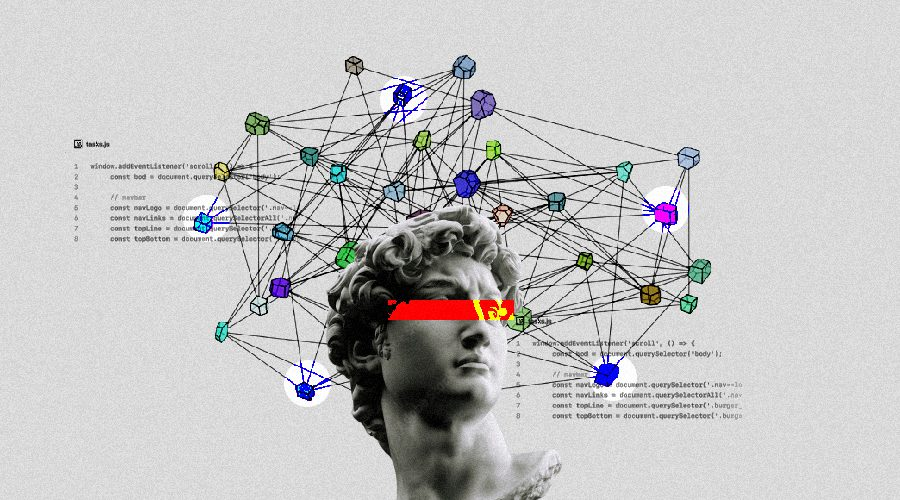

<h1 align="center">Hi 👋, I'm Manith!!!</h1>
<h1 align="center">
    
</h1>
<h3 align="center">Computer Engineering Undergraduate | Volunteer in Tech | AI & Data Science Enthusiast</h3>

  

- 🌱 I’m currently learning **Data Science & Machine Learning**

- 📫 Reach me at **https://manith.me/**

  

